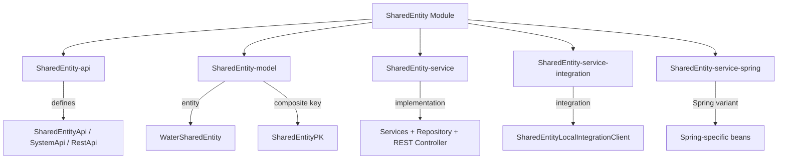
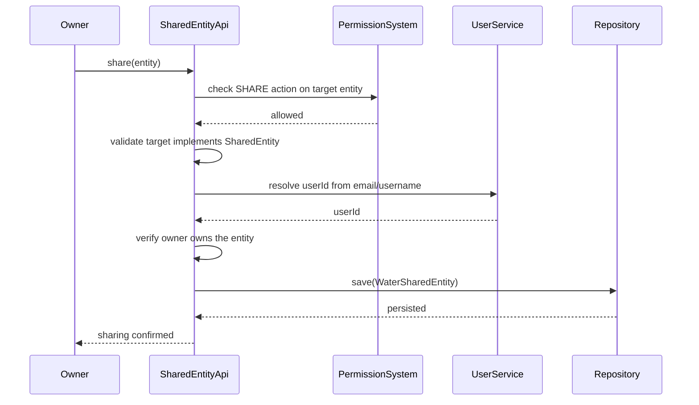

# SharedEntity Module

The **SharedEntity** module enables entity sharing between users in the Water Framework. It allows the owner of a resource to grant access to other users with granular permission control, using a composite primary key model to track sharing relationships.

## Architecture Overview



## Sub-modules

| Sub-module | Description |
|---|---|
| **SharedEntity-api** | Defines `SharedEntityApi`, `SharedEntitySystemApi`, `SharedEntityRestApi`, and `SharedEntityRepository` interfaces |
| **SharedEntity-model** | Contains `WaterSharedEntity` entity and `SharedEntityPK` composite key |
| **SharedEntity-service** | Default implementation of services, repository, and REST controller |
| **SharedEntity-service-integration** | Integration client for cross-service shared entity operations |
| **SharedEntity-service-spring** | Spring-specific service registration |

## WaterSharedEntity

The entity uses a **composite primary key** (`@IdClass`) rather than a standard auto-generated ID:

```java
@Entity
@Table(uniqueConstraints =
    @UniqueConstraint(columnNames = {"entityResourceName", "entityId", "userId"}))
@IdClass(SharedEntityPK.class)
@AccessControl(availableActions = { CrudActions.class },
    rolesPermissions = {
        @DefaultRoleAccess(roleName = "sharedentityManager", actions = { "save","update","find","find_all","remove" }),
        @DefaultRoleAccess(roleName = "sharedentityViewer", actions = { "find", "find_all" }),
        @DefaultRoleAccess(roleName = "sharedentityEditor", actions = { "save","update","find","find_all" })
    })
public class WaterSharedEntity extends AbstractJpaEntity implements ProtectedEntity {
    @Id private String entityResourceName;  // Target entity class name
    @Id private long entityId;              // Target entity ID
    @Id private long userId;                // User being granted access
}
```

### Composite Key (SharedEntityPK)

```java
public class SharedEntityPK implements Serializable {
    private String entityResourceName;
    private long entityId;
    private long userId;
}
```

The combination of `(entityResourceName, entityId, userId)` uniquely identifies a sharing relationship — "entity X of type Y is shared with user Z."

### Entity Fields

| Field | Type | Key | Description |
|---|---|---|---|
| `entityResourceName` | String | `@Id` | Fully qualified class name of the shared entity |
| `entityId` | Long | `@Id` | ID of the shared entity instance |
| `userId` | Long | `@Id` | ID of the user receiving access |
| `userEmail` | String | Transient | Email for user resolution (write-only) |
| `username` | String | Transient | Username for user resolution (write-only) |

## How Sharing Works



**Key rules:**
1. The target entity class must implement the `SharedEntity` interface
2. The caller must have the `SHARE` action permission on the target entity
3. The caller must be the owner of the entity being shared
4. Users can be identified by `userId`, `userEmail`, or `username`

## API Interfaces

### SharedEntityApi (Public — with permission checks)

| Method | Description |
|---|---|
| `findByPK(String entityResourceName, long entityId, long userId)` | Find a specific sharing relationship |
| `removeByPK(WaterSharedEntity entity)` | Remove a sharing relationship |
| `findByEntity(String entityResourceName, long entityId)` | Find all users sharing a specific entity |
| `findByUser(long userId)` | Find all entities shared with a specific user |
| `getSharingUsers(String entityResourceName, long entityId)` | Get user IDs that have access to an entity |
| `getEntityIdsSharedWithUser(String entityResourceName, long userId)` | Get entity IDs shared with a user |

> **Note:** Standard `update`, `remove`, and `find` (by single ID) operations from `BaseEntityApi` are **disabled** and throw `UnsupportedOperationException`. Use the composite-key methods instead.

### SharedEntitySystemApi (System — no permission checks)

Same methods as `SharedEntityApi` but without permission enforcement, for internal service-to-service operations.

### REST Endpoints

| HTTP Method | Path | Action |
|---|---|---|
| `POST` | `/water/sharedentities` | Share an entity with a user |
| `DELETE` | `/water/sharedentities/{resourceName}/{entityId}/{userId}` | Remove a sharing |
| `GET` | `/water/sharedentities/entity/{resourceName}/{entityId}` | Find all sharings for an entity |
| `GET` | `/water/sharedentities/user/{userId}` | Find all sharings for a user |

## Default Roles

| Role | Permissions |
|---|---|
| **sharedentityManager** | `save`, `update`, `find`, `find_all`, `remove` |
| **sharedentityViewer** | `find`, `find_all` |
| **sharedentityEditor** | `save`, `update`, `find`, `find_all` |

## Usage Example

```java
@Inject
private SharedEntityApi sharedEntityApi;

// Share a project with another user
WaterSharedEntity sharing = new WaterSharedEntity();
sharing.setEntityResourceName("com.example.model.Project");
sharing.setEntityId(42L);
sharing.setUserEmail("colleague@example.com");  // Resolved to userId internally

sharedEntityApi.save(sharing);

// Find all users sharing a project
Collection<WaterSharedEntity> sharings =
    sharedEntityApi.findByEntity("com.example.model.Project", 42L);

// Get entity IDs shared with a specific user
Collection<Long> sharedIds =
    sharedEntityApi.getEntityIdsSharedWithUser("com.example.model.Project", userId);
```

## Making an Entity Shareable

To make your entity shareable, implement the `SharedEntity` interface:

```java
@Entity
public class Project extends AbstractJpaEntity implements SharedEntity, OwnedResource {
    // Your entity fields...

    @Override
    public long getUserId() {
        return this.ownerUserId;
    }
}
```

## Dependencies

- **Core-api** — Base interfaces and annotations
- **Core-model** — `AbstractJpaEntity`, `ProtectedEntity`
- **Core-security** — `@AccessControl`, `@AllowGenericPermissions`, `@AllowPermissionsOnReturn`
- **Permission** — Permission system for SHARE action validation
- **User** — User resolution from email/username
- **Repository / JpaRepository** — Persistence layer
- **Rest** — REST controller infrastructure
